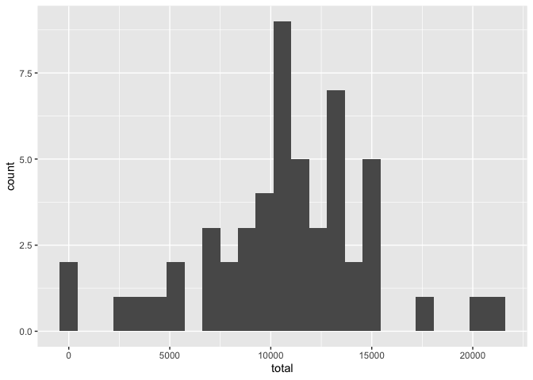
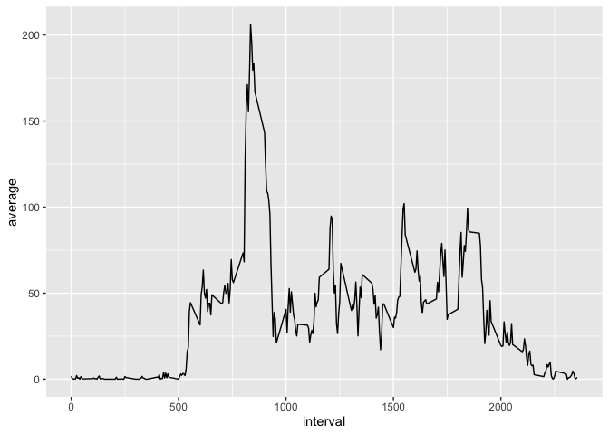
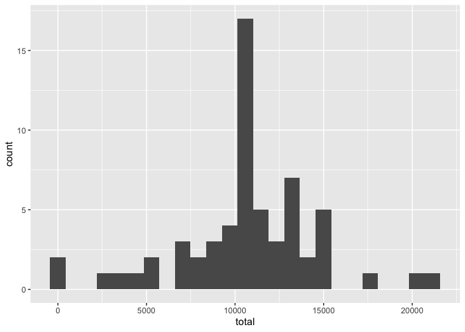
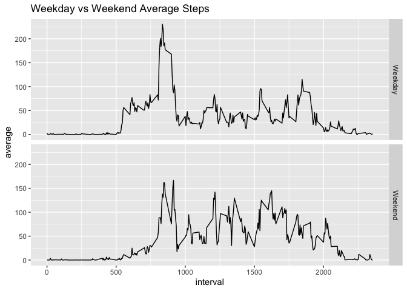

### Introduction
It is now possible to collect a large amount of data about personal movement using activity monitoring devices such as a Fitbit, Nike Fuelband, or Jawbone Up. These type of devices are part of the “quantified self” movement – a group of enthusiasts who take measurements about themselves regularly to improve their health, to find patterns in their behavior, or because they are tech geeks. But these data remain under-utilized both because the raw data are hard to obtain and there is a lack of statistical methods and software for processing and interpreting the data.

This assignment makes use of data from a personal activity monitoring device. This device collects data at 5 minute intervals through out the day. The data consists of two months of data from an anonymous individual collected during the months of October and November, 2012 and include the number of steps taken in 5 minute intervals each day.

The data for this assignment can be downloaded from the course web site:

* Dataset: [Activity monitoring data](https://d396qusza40orc.cloudfront.net/repdata%2Fdata%2Factivity.zip) 

The variables included in this dataset are:

steps: Number of steps taking in a 5-minute interval (missing values are coded as 𝙽𝙰) </br>
date: The date on which the measurement was taken in YYYY-MM-DD format </br>
interval: Identifier for the 5-minute interval in which measurement was taken </br>
The dataset is stored in a comma-separated-value (CSV) file and there are a total of 17,568 observations in this dataset. 

## I. Loading and preprocessing the data

```r
# reading in the csv
url <- "https://d396qusza40orc.cloudfront.net/repdata%2Fdata%2Factivity.zip"
download.file(url, destfile = paste0(getwd(), '/repdata%2Fdata%2Factivity.zip'), method = "curl")
unzip("repdata%2Fdata%2Factivity.zip")
data <- data.table::fread(input = "activity.csv")
```
        
## II. What is mean total number of steps taken per day?
For this part of the assignment, you can ignore the missing values in the dataset.

1. Calculate the total number of steps taken per day
2. If you do not understand the difference between a histogram and a barplot, research the difference between them. Make a histogram of the total number of steps taken each day
3. Calculate and report the mean and median of the total number of steps taken per day


```r
# calculating mean/median number of steps per day
daily.steps <- data %>%
        subset(!is.na(steps)) %>%
        group_by(date) %>%
        summarise(total = sum(steps))

# mean number of steps per day
mean(daily.steps$total)
```

```
## [1] 10766.19
```

```r
# median number of steps per day
median(daily.steps$total)
```

```
## [1] 10765
```

```r
# histogram of total number of steps per day
ggplot(daily.steps, aes(x = total)) +
        geom_histogram(bins = 25)
```

<!-- -->

## III. What is the average daily activity pattern?
1. Make a time series plot (i.e. \color{red}{\verb|type = "l"|}type="l") of the 5-minute interval (x-axis) and the average number of steps taken, averaged across all days (y-axis)
2. Which 5-minute interval, on average across all the days in the dataset, contains the maximum number of steps?


```r
# calculating average number of steps by interval
interval.steps <- data %>%
        subset(!is.na(steps)) %>%
        group_by(interval) %>%
        summarise(average = mean(steps))

# descriptive stats for average number of steps by interval
summary(interval.steps$average)
```

```
##    Min. 1st Qu.  Median    Mean 3rd Qu.    Max. 
##   0.000   2.486  34.113  37.383  52.835 206.170
```

```r
# show top 5 intervals for total number of steps per day
arrange(interval.steps, desc(average))[1:5,1:2]
```

```
## # A tibble: 5 x 2
##   interval average
##      <int>   <dbl>
## 1      835    206.
## 2      840    196.
## 3      850    183.
## 4      845    180.
## 5      830    177.
```

```r
# time series plot of total number of steps per day
ggplot(interval.steps, aes(x = interval, y = average)) +
        geom_line()
```

<!-- -->


## IV. Imputing missing values 
Note that there are a number of days/intervals where there are missing values (coded as \color{red}{\verb|NA|}NA). The presence of missing days may introduce bias into some calculations or summaries of the data.

1. Calculate and report the total number of missing values in the dataset (i.e. the total number of rows with \color{red}{\verb|NA|}NAs)
2. Devise a strategy for filling in all of the missing values in the dataset. The strategy does not need to be sophisticated. For example, you could use the mean/median for that day, or the mean for that 5-minute interval, etc.
3. Create a new dataset that is equal to the original dataset but with the missing data filled in.
4. Make a histogram of the total number of steps taken each day and Calculate and report the mean and median total number of steps taken per day. Do these values differ from the estimates from the first part of the assignment? What is the impact of imputing missing data on the estimates of the total daily number of steps?

```r
# count the total number of missing values in the dataset
total.na <- data %>%
        count(is.na(steps))
as.numeric(total.na[2,2])
```

```
## [1] 2304
```


```r
# Imputing missing values with mean imputation  
data.imputed <- data %>%
        group_by(interval) %>%
        mutate(steps = replace(steps, is.na(steps), mean(steps, na.rm = TRUE)))

# calculating steps per day with mean imputation
daily.steps.imputed <- data.imputed %>%
        subset(!is.na(steps)) %>%
        group_by(date) %>%
        summarise(total = sum(steps))

# histogram of total number of steps per day
ggplot(daily.steps.imputed, aes(x = total)) +
        geom_histogram(bins = 25)
```

<!-- -->

```r
# mean number of steps per day
mean(data.imputed$steps)
```

```
## [1] 37.3826
```

```r
# median number of steps per day
median(data.imputed$steps)
```

```
## [1] 0
```

## V. Are there differences in activity patterns between weekdays and weekends?
For this part the \color{red}{\verb|weekdays()|}weekdays() function may be of some help here. Use the dataset with the filled-in missing values for this part.

1. Create a new factor variable in the dataset with two levels – “weekday” and “weekend” indicating whether a given date is a weekday or weekend day.
2. Make a panel plot containing a time series plot (i.e. \color{red}{\verb|type = "l"|}type="l") of the 5-minute interval (x-axis) and the average number of steps taken, averaged across all weekday days or weekend days (y-axis). See the README file in the GitHub repository to see an example of what this plot should look like using simulated data.

```r
# classifying days
data.imputed["day"] <- weekdays(as.Date(data.imputed$date))
data.imputed$type_day <- ifelse(data.imputed$day == "Saturday" | data.imputed$day == "Sunday", "Weekend", "Weekday")
data.imputed$type_day <- as.factor(data.imputed$type_day)

data.imputed.type <- data.imputed %>%
        group_by(type_day, interval) %>%
        summarise(average = mean(steps))

# plotting time series plot of average steps, faceted by day type
ggplot(data.imputed.type, aes(x = interval, y = average)) +
        geom_line() +
        facet_grid(type_day ~ .) +
        ggtitle("Weekday vs Weekend Average Steps")
```

<!-- -->
<br><br>
It appears there is a difference between weekday and weekend activity patterns. Specifically, activity begins later in the morning, likely meaning that participants were sleeping in later during Saturday and Sunday. 
